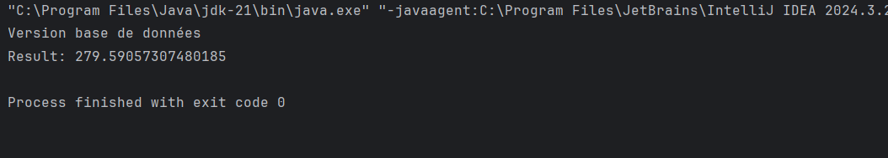

```markdown
# TP - Injection des Dépendances

Ce TP a pour objectif de comprendre et de mettre en pratique le concept d'injection des dépendances en Java, en utilisant à la fois des méthodes manuelles et le framework Spring.

---

## 📁 Structure du Projet

```
src/
├── main/
│   ├── java/
│   │   ├── dao/
│   │   │   └── DaoImpl.java          # Implémentation de l'interface IDao
│   │   ├── metier/
│   │   │   └── MetierImpl.java       # Implémentation de l'interface IMetier
│   │   └── presentation/
│   │       ├── StaticInjection.java  # Injection statique
│   │       ├── DynamicInjection.java # Injection dynamique
│   │       └── SpringInjection.java  # Injection avec Spring
│   └── resources/
│       └── applicationContext.xml    # Configuration Spring (XML)
├── test/
│   └── java/                         # Tests unitaires (optionnel)
└── pom.xml                           # Fichier de configuration Maven (optionnel)
```

---

## 🛠️ Étapes du TP

### 1. Création des Interfaces
- **`IDao`** : Interface avec la méthode `double getData()`.
- **`IMetier`** : Interface avec la méthode `double calcul()`.

### 2. Implémentation des Interfaces
- **`DaoImpl`** : Implémentation de `IDao` qui génère une valeur aléatoire.
- **`MetierImpl`** : Implémentation de `IMetier` qui utilise `IDao` pour effectuer un calcul.

### 3. Injection des Dépendances
- **Injection Statique** : Instanciation manuelle des dépendances dans `StaticInjection.java`.
- **Injection Dynamique** : Utilisation d'une méthode de fabrique pour instancier les dépendances dans `DynamicInjection.java`.
- **Injection avec Spring** : Configuration des beans dans `applicationContext.xml` et utilisation de `SpringInjection.java` pour charger le contexte Spring.

---

## 🚀 Comment Exécuter le Projet

### Prérequis
- Java JDK 8 ou supérieur.
- (Optionnel) Maven pour la gestion des dépendances.
- (Optionnel) Spring Framework si vous utilisez l'injection avec Spring.


```

---


## 📦 Gestion des Dépendances (Optionnel)

Si vous utilisez Maven, ajoutez la dépendance Spring dans `pom.xml` :

```xml
<dependency>
    <groupId>org.springframework</groupId>
    <artifactId>spring-context</artifactId>
    <version>5.3.25</version>
</dependency>
```

---

## 📝 Résultats Attendus

- **Injection Statique/Dynamique** : Le programme affiche un résultat calculé à partir d'une valeur générée par `DaoImpl`.
- **Injection avec Spring** : Le programme utilise le fichier `applicationContext.xml` pour configurer et injecter les dépendances.
- 

---

## 📚 Ressources Utiles

- [Professeur Mohamed YOUSSFI ](https://www.youtube.com/watch?v=N6_IL2cxVrs)
---

## 👨‍💻 Auteur

Ce TP a été réalisé par ElBatir ElMahdi dans le cadre du cours Architecture JEE et Systèmes Distribués.

